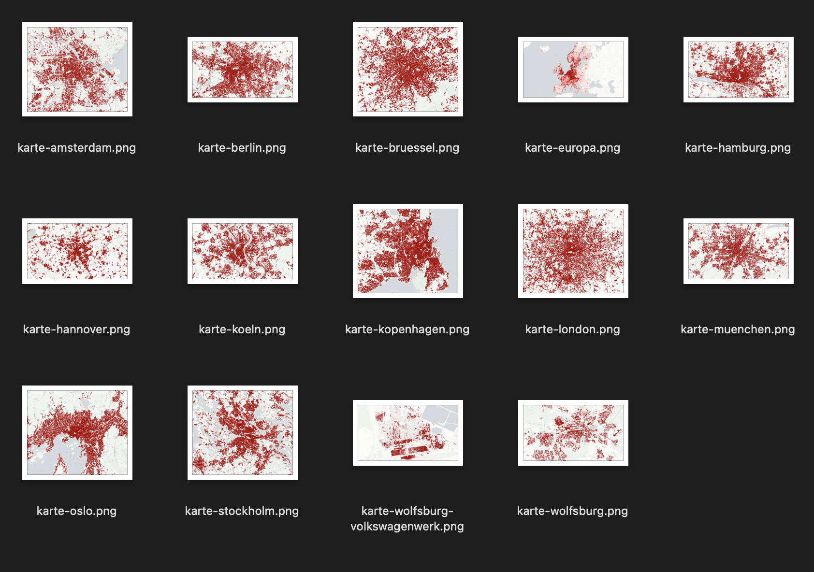

Grafiken aus dem Vortrag ["Wir wissen wo dein Auto steht - Volksdaten von Volkswagen"](https://fahrplan.events.ccc.de/congress/2024/fahrplan/talk/Q8ZAV9/) auf dem 38C3.

# Überblick Karten

Die Karten stehen unter: CC BY 4.0 Michael Kreil

Die anonymisierte Daten liegen als komprimierte GeoJSONs dabei.

# Überblick Zeichnungen

Die Zeichnungen stehen unter: CC BY 4.0 Stella

